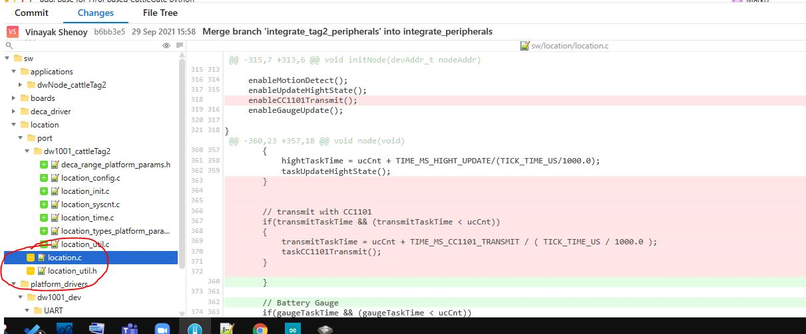
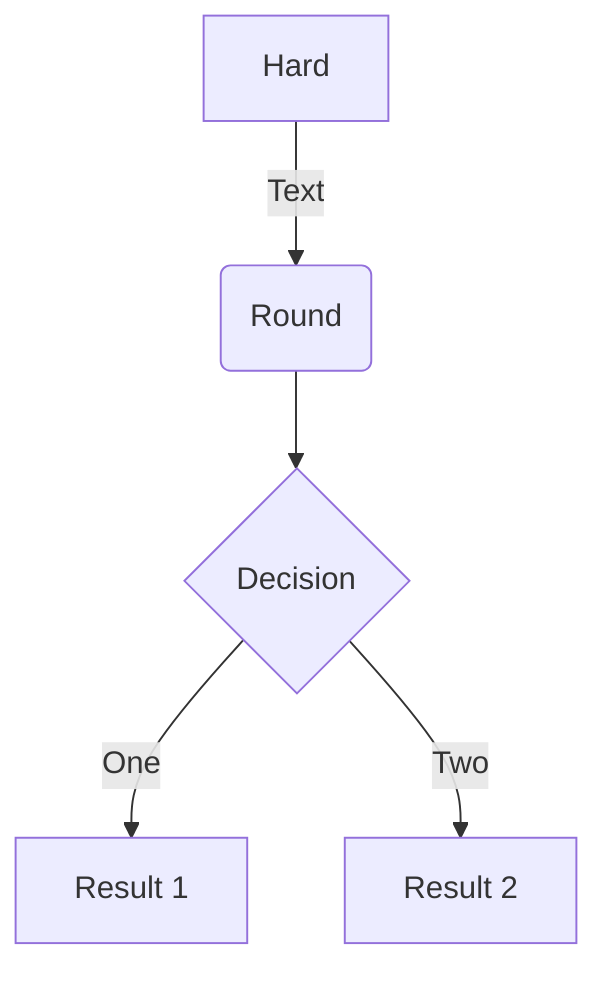

<!-- vscode-markdown-toc -->
* 1. [Components](#Components)
* 2. [Input Voltages](#InputVoltages)
	* 2.1. [I2C timing diagram](#I2Ctimingdiagram)

<!-- vscode-markdown-toc-config
	numbering=true
	autoSave=true
	/vscode-markdown-toc-config -->
<!-- /vscode-markdown-toc --># Apple  
A DIY converted ebike 



##  1. <a name='Components'></a>Components
- Microntroller **NRF52832/NRF52840**
- GPS module **U-blox**
- Indoor localization **DWM1001**

##  2. <a name='InputVoltages'></a>Input Voltages
| Components|cost 
| -----------|--------|
| MCU| `20euros` |



##infrared
$$\lambda=\frac{v}{f}$$
$$\frac{d}{f}\equiv \tfrac{d}{3}f\left( tom \right(fdf)) )javk$$

```sequence {theme="hand"}
Title: Here is a title
A->B: Normal line
B-->C: Dashed line
C->>D: Open arrow

D-->>A: Dashed open arrow
```

###  2.1. <a name='I2Ctimingdiagram'></a>I2C timing diagram
```wavedrom
{signal: [
  {name: 'clk', wave: 'p.....|...'},
  {name: 'dat', wave: 'x.345x|=.x', data: ['head', 'body', 'tail', 'data']},
  {name: 'req', wave: '0.1..0|1.0'},
  {},
  {name: 'ack', wave: '1.....|01.'}
]}
```
